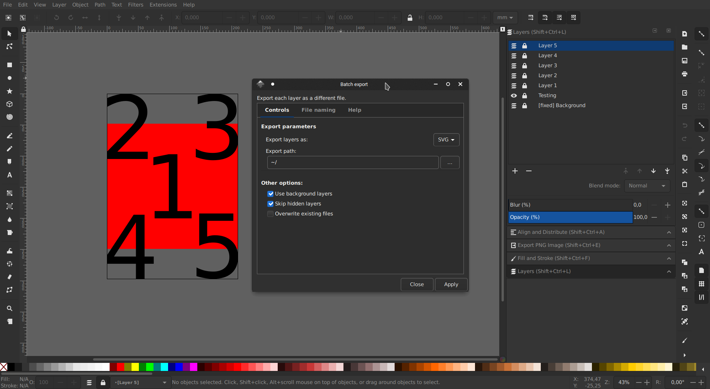
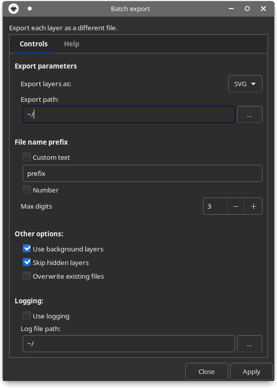

<p align="center">
    
</p>

This extension will help you export your work easier:
- Export each layer as a separate file
- Choose which layers to export
- Automated file naming
- Supports multiple export file formats
- Configure background layers



# Install
Download this project and copy the extension files (`batch_export.inx` and `batch_export.py`) to the config path of your Inkscape installation.

On Linux, the path may be:
```
~/.config/inkscape/extensions
```

If you installed the flatpak version:
```
~/.var/app/org.inkscape.Inkscape/config/inkscape/extensions
```

Depending on your operating system, this path will vary. If none of the above work, try searching for "Inkscape config path" for your OS.

# Usage
After the extension is installed, it can be found in the *Extensions* menu, *Export* submenu.



### Export parameters

In this section, you can choose to export the layers as SVG or as PNG files at your desired location.

### File name prefix

By default, each exported file will have the name of the layer.

**Custom text** - If you choose this option you can define a text prefix that will be included in all the exported files.
```
Ex. prefix_layer1.svg
```

**Number** - if you choose this option you can define a number prefix that will be included in all the exported files. This can be configured using the `Max digits` value, between 1 and 5.
```
Ex. 001_layer1.svg

Max-digits = 2 -> [01, 02, ... , 99]
Max-digits = 3 -> [001, 002, ... , 999]
```
The export will stop when all the numbers are used so make sure you set this option correctly, otherwise not all the layers may be exported.

**Both** - you can use both options, in which case the file name will have the following pattern:
```
001_prefix_layer1.svg
```

### Other options
* Check the **Use background layers** options if you want to have one or more layers that will appear in all exports. You also need to name these layers with a fixed tag at the beginning.
```
Ex. [fixed] Background
```
* If you have any layers that you don't want to be exported, just hide them in the layer panel of Inkscape and then turn on the **Skip hidden layers** option. This way you can have other testing or mockup layers in your file and still be able to export all the others.
* If in the export path there are any other files with the same name as one of the exported files, the extension will not overwrite that file, therefore not exporting that particular layer(s). If you don't want this behaviour you can turn on the **Overwrite existing files** option. This option is turned off by default to make sure you don't lose any files by mistake.

### Logging
You can turn on this option and the extension will create a log file at the log file path. This may be useful if you try to debug the extension or see a more in-depth log of its actions, although I recommend checking the source code for that :).

# Result
This is the result of using the extension to export the layers of the [file](test/batch-export-test.svg) shown in the first screenshot. In that file, I have one background layer containing a red rectangle, one testing layer that is hidden and five layers that I want to export.


**Disclosure:** Each exported file will only contain the data corresponding to that specific layer and background layers only.

**Explanation:** An SVG file can contain data that is not visible when displayed as an image. There can be multiple hidden layers in the file, that will not show up when opened with an image viewer, but still take up space in the file. For example, you cand have a file with two layers, layer1 containing a rectangle and layer2 containing a circle. If you hide layer1, save the file as an SVG and open it with an image viewer, only the circle will be displayed, however, the layer containing the rectangle is still in the file, but the image viewer knows not to display it. That means, not only that your file will have a size bigger than it needs to, but will also contain private data that you may not wish to save or share with others.

This extension will keep the exported files to **minimum size** and keep **your data private** by exporting only the visible data of your work.

# Notes
So far, I have only tested this extension in Inkscape 1.0, on Linux. I used the flatpak version, but I think it will work with the one from your distribution package manager as well. I don't know if it will work on Windows or macOS, yet.

# License
This project is licensed under the [MIT](https://github.com/StefanTraistaru/batch-export/blob/master/LICENSE.md) license.

# 🙌 Become a supporter
Help in maintaining this project by giving me a cup of coffee :)

[](https://www.paypal.com/cgi-bin/webscr?cmd=_s-xclick&hosted_button_id=JDW4SPTJACYSJ&source=url)

