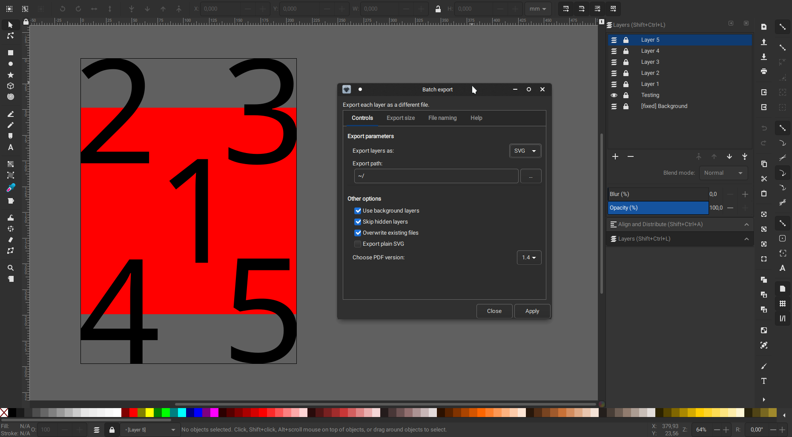
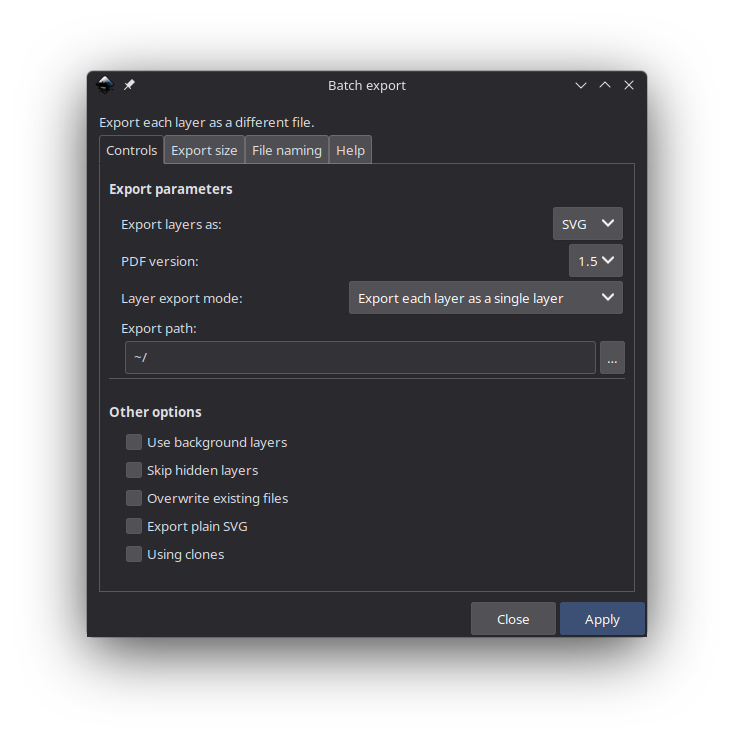
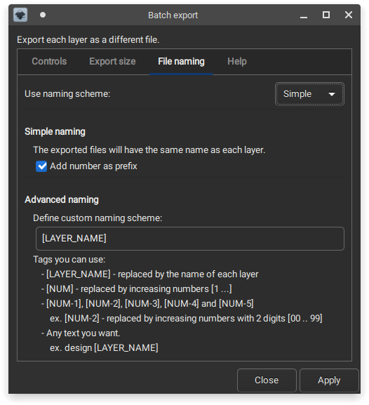

<p align="center">
    
</p>

This extension will help you export your work easier:
- Supports multiple export file formats (SVG, PNG, PS, EPS, PDF, EMF, WMF, XAML).
- Export each layer as a separate file.
- Choose which layers to export.
- Automated file naming.
- Configure background layers.



# Install
Download this project and copy the extension files (`batch_export.inx` and `batch_export.py`) to the config path of your Inkscape installation.

One simple way of finding the config path is to open Inkscape and go to **Edit > Preferences > System**. The path will be listed in the **User extensions** field. Make sure you restart Inkscape after you copied the extension files at the desired location and the extension will be available in the extensions menu.

### Linux
The default path on Linux is:
```
~/.config/inkscape/extensions
```

If you installed the flatpak version:
```
~/.var/app/org.inkscape.Inkscape/config/inkscape/extensions
```

### Windows
The path on Windows 10 is this:
```
C:\Users\[yourWindowsusername]\AppData\Roaming\inkscape\extensions
```
If you don't see the AppData folder, you need to set the windows explorer to show hidden files.

# Usage
After the extension is installed, it can be found in the **Extensions** menu, **Export** submenu.

</img>
</img>

### Controls

* Export parameters
    * In this section, you can choose to export the layers at your desired location.
    * The output files can be exported in one of the following formats: SVG, PNG, PS, EPS, PDF, EMF, WMF, XAML.

* Other options
    * Check the **Use background layers** options if you want to have one or more layers that will appear in all exports. You also need to name these layers with a fixed tag at the beginning.
    ```
    Ex. [fixed] Background
    ```
    * If you have any layers that you don't want to be exported, just hide them in the layer panel of Inkscape and then turn on the **Skip hidden layers** option. This way you can have other testing or mockup layers in your file and still be able to export all the others.
    * If in the export path there are any other files with the same name as one of the exported files, the extension will not overwrite that file, therefore not exporting that particular layer(s). If you don't want this behaviour you can turn on the **Overwrite existing files** option. This option is turned off by default to make sure you don't lose any files by mistake.
    * Choose the **export plain SVG** option to remove any Inkscape-specific SVG attributes/properties.
    * If you want to export the files in PDF format you can choose the PDF version to be used(1.4 or 1.5).

### Export size

On the second page you can configure both the area that is exported and the size and resolution of the output file(if it supports it).
* **Export area**
    * Page - Area to export is page.
    * Drawing - Area to export is whole drawing (ignoring page size).
    * Custom - Define a custom area to export in SVG user units.
* **Export resolution**
    * Default - no custom options.
    * Custom DPI - Resolution for bitmaps and rasterized filters.
    * Custom size - Set width and height of the output file.


</img>
</img>

### File naming

On this page you can choose on of the two systems that can be used for naming files.

* **Simple naming**
    * This is the default system used to name the exported files.
    * Each file is named the same as each layer.
    * Optionally, you can choose to number each file. The number will prefix the layer name.
    
* **Advanced naming**
    * This naming system will allow you more freedom in naming the exported files, but you have to make sure the names will have a correct format according to your OS.
    * It works by using a user defined custom naming scheme composed of tags and text.
    * Available tags
        * [LAYER_NAME] - it will be replaced by the name of each layer.
        * [NUM] - it will be replaced by an automatically increasing number.
        * [NUM-1] - same as [NUM], but the numbers range between [1, .., 9].
        * [NUM-2] - same as [NUM], but the numbers range between [01, .., 99].
        * [NUM-3] - same as [NUM], but the numbers range between [001, .., 999].
        * [NUM-4] - same as [NUM], but the numbers range between [0001, .., 9999].
        * [NUM-5] - same as [NUM], but the numbers range between [00001, .., 99999].
        * *Be aware!* For example, if you use [NUM-2] to export more than 99 layers, the numbers above 99 will increase normally but they will not keep the same 2 digit syle format. This applies for all [NUM-number] tags and their respectiv max limit.
    * Apart from tags, you can also enter any custom text that you want
    * Examples of custom naming schemes
        * `[NUM] [LAYER_NAME]` will result in "1 layer 1.svg", "2 layer 2.svg".
        * `design [NUM-2]` will result in "desing 01.svg", "design 02.svg".
        * `[NUM] haha [LAYER_NAME] -hello- [NUM-4]` will result in "1 haha layer 1 -hello- 0001.svg" (I don't know why would you want to do something like this, but you can :) ).

### Help

On this page you can access the logging function of the extension. You can turn on this option and the extension will create a log file at the log file path. If a log file already exists, it will add the new logs at the end of that file. You can optionally choose to overwrite the existing log file. This may be useful if you try to debug the extension or see a more in-depth log of its actions, although I recommend checking the source code for that :).

# Result
This is the result of using the extension to export the layers of the [file](test/batch-export-test.svg) shown in the first screenshot. In that file, I have one background layer containing a red rectangle, one testing layer that is hidden and five layers that I want to export.


**Disclosure:** Each exported file will only contain the data corresponding to that specific layer and background layers only.

**Explanation:** An SVG file can contain data that is not visible when displayed as an image. There can be multiple hidden layers in the file, that will not show up when opened with an image viewer, but still take up space in the file. For example, you cand have a file with two layers, layer1 containing a rectangle and layer2 containing a circle. If you hide layer1, save the file as an SVG and open it with an image viewer, only the circle will be displayed, however, the layer containing the rectangle is still in the file, but the image viewer knows not to display it. That means, not only that your file will have a size bigger than it needs to, but will also contain private data that you may not wish to save or share with others.

This extension will keep the exported files to **minimum size** and keep **your data private** by exporting only the visible data of your work.

# Notes
This extension works with **Inkscape 1.0**.
* ✔️ **Linux** - I have tested it on Linux, using the flatpak version but I think it will work with the one from your distribution package manager as well.
* ✔️ **Windows 10** - I have also tested it on Windows 10 with both the version from the Inkscape website and the one from the Microsoft Store.
* ❓ **macOS** - I do not own any Apple devices, so I cannot tell you if it will work on macOS, although I don't think there might be any compatibility issues. If you have a macOS device, please try it and let me know.

# License
This project is licensed under the [MIT](https://github.com/StefanTraistaru/batch-export/blob/master/LICENSE.md) license.

# Become a supporter 🙌
Help in maintaining this project by giving me a cup of coffee :)

[](https://www.paypal.com/cgi-bin/webscr?cmd=_s-xclick&hosted_button_id=JDW4SPTJACYSJ&source=url)

